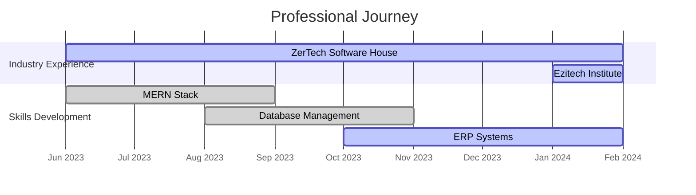

# Syed Muhammad Fahad 💻

  
  

  <!-- Stats Cards -->
  

    
    
  

  <!-- Tech Stack -->
  <h2>🛠 Tech Stack</h2>
  
  <h3>💻 Languages</h3>
  
  
  
  
  
  <h3>🌐 Frontend</h3>
  
  
  
  
  
  
  <h3>⚙️ Backend & Databases</h3>
  
  
  
  
  
  <h3>🔧 Tools</h3>
  
  
  
  

---

## 📊 Experience Timeline

---

## 💼 Professional Experience

| Company | Role | Duration | Tech Used |
|---------|------|----------|-----------|
| **ZerTech Software House** | Software Development Engineer | June 2023 - Present | React, Node.js, MySQL, MongoDB |
| **Ezitech Institute** | Full Stack Developer Intern | Jan 2024 - Present | MERN Stack, Git, REST APIs |

### 🚀 Current Work
- **ERP System Development** at ZerTech Software House
- **MERN Stack Projects** implementation
- **Database Design & Optimization**
- **RESTful API Development**

---

## 📈 GitHub Activity

<!-- Top Languages -->

<!-- Activity Graph -->

---

## 🎯 Skills Breakdown

| Category | Skills |
|----------|--------|
| **Programming** | JavaScript, Java, Python, C++ |
| **Frontend** | React, HTML5, CSS3, Tailwind, Bootstrap |
| **Backend** | Node.js, Express.js, REST APIs |
| **Databases** | MongoDB, MySQL, Mongoose |
| **Tools** | Git, GitHub, VS Code, Postman |
| **Concepts** | DSA, OOP, System Design |

---

## 📫 Connect With Me

---

  
  
  
  *Always open to new opportunities and collaborations!* ✨
  

